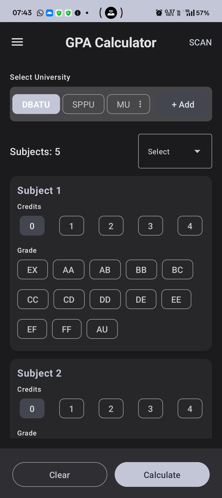
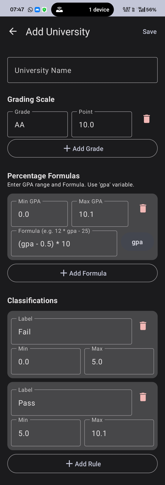
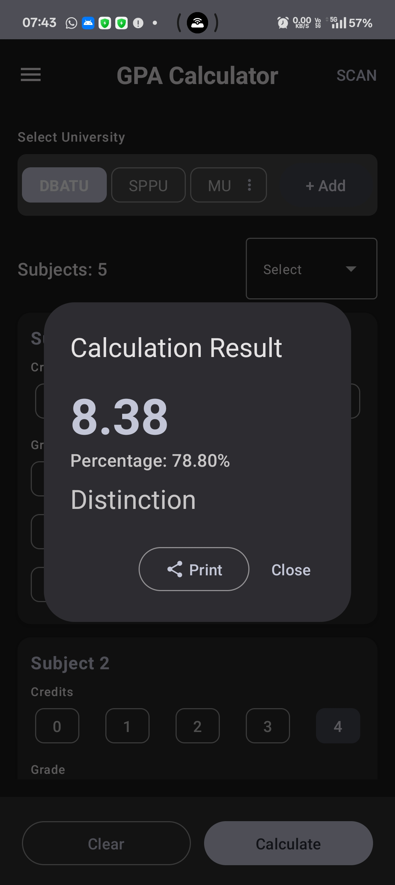
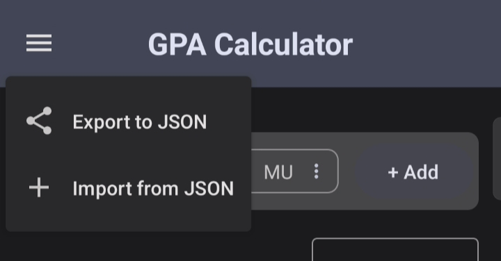

# Multi-University GPA Calculator 🎓

A powerful and flexible Android application built with **Kotlin** and **Jetpack Compose** designed to calculate GPA for students across different universities with varying grading systems.

## 📱 App Overview

This app allows students and teachers to calculate GPA based on custom grading scales, credits, and university-specific rules. It comes pre-loaded with presets for **DBATU** and **SPPU**, but its core strength lies in its ability to let users define their own university logic.

---

## ✨ Key Features

### 1. Dashboard & Calculation
The main dashboard provides a clean interface to select your university, define the number of subjects (up to 50), and input course details.

  

* **University Selector:** Scrollable list of universities. Long-press custom universities to Edit or Delete them.
* **Subject Management:** Dynamically select between 3 to 50 subjects.
* **Input Cards:** Easy-to-use chips for selecting Credits (0-5) and Grades.

### 2. Custom University Engine
Don't see your university? Add it! You can define a completely custom grading logic.

  

* **Flexible Grading Scale:** Define grade symbols (e.g., "AA", "O", "B+") and their corresponding grade points (e.g., 10.0, 9.5).
* **Classification Rules:** Set rules for results like "Distinction", "First Class", or "Fail" based on GPA ranges.
* **Persistence:** All custom universities are saved locally on your device.

### 3. Accurate Results
Get instant, accurate GPA calculations along with your class/grade classification based on the specific university's rules.

  

* **Precision:** Calculates GPA to two decimal places.
* **Classification:** Automatically determines if you passed, failed, or achieved a distinction.

### 4. Data Portability (Import/Export)
Seamlessly share your custom university configurations with classmates or transfer them to a new device.

  

* **Export:** Save your custom universities as a `.json` file.
* **Import:** Load configurations from a `.json` file instantly.

---

## 🛠️ Technical Stack

* **Language:** Kotlin
* **UI Framework:** Jetpack Compose (Material Design 3)
* **Architecture:** MVVM (Model-View-ViewModel)
* **State Management:** Kotlin Coroutines & StateFlow
* **Storage:** SharedPreferences (JSON serialization)

## 🚀 How to Build

1.  Clone this repository.
2.  Open the project in **Android Studio**.
3.  Sync Gradle to download dependencies.
4.  Run on an Emulator or Physical Device.
