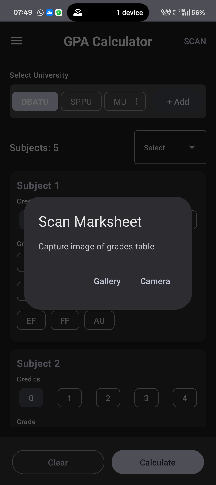
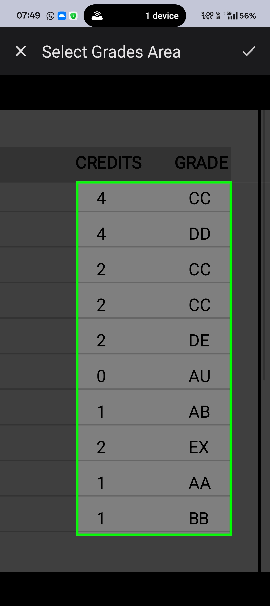
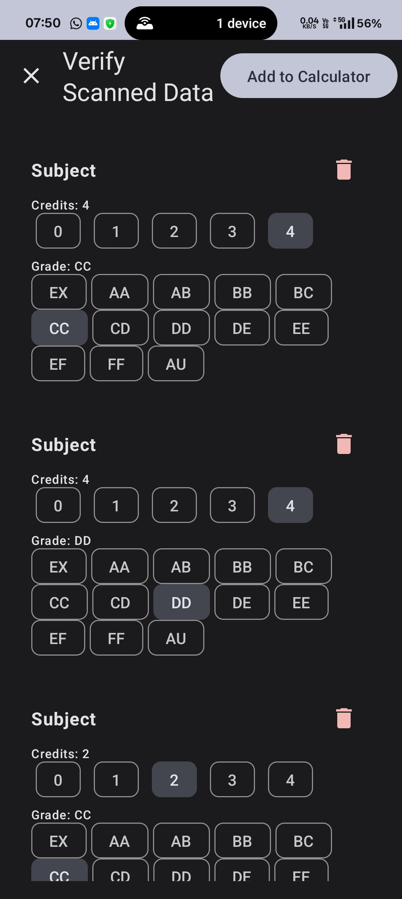
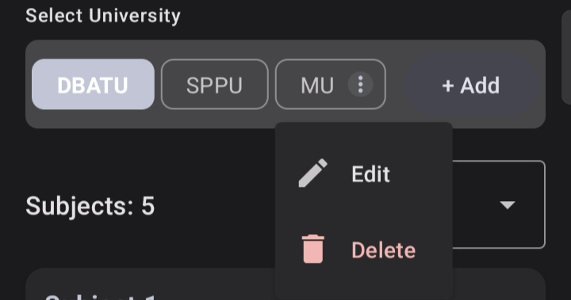
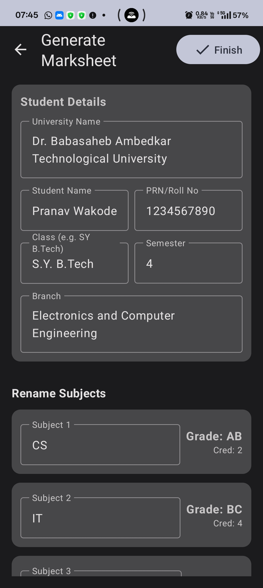
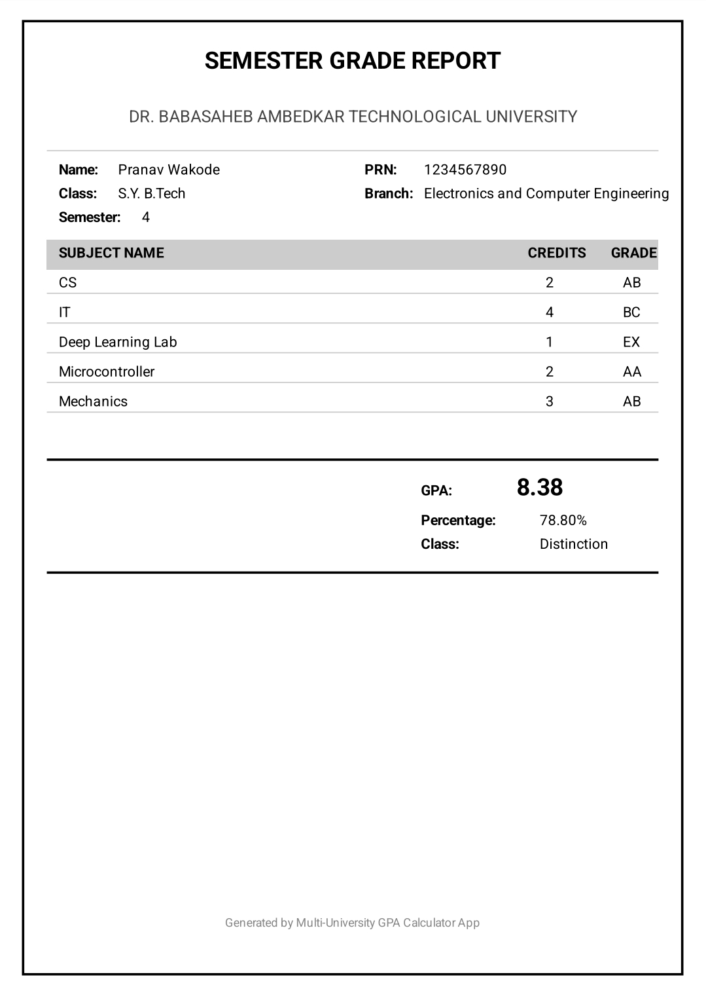

# Multi-University GPA Calculator 🎓

A powerful, feature-rich Android application built with **Kotlin** and **Jetpack Compose** designed to calculate GPA, generate marksheets, and scan physical documents using on-device Machine Learning.

---

## 📱 App Overview

This app goes beyond simple calculation. It allows students to define custom university grading logic, scan their physical marksheets using **ML Kit OCR**, and generate professional PDF reports. It comes pre-loaded with presets for **DBATU** and **SPPU**, but is fully fully customizable for any institution.

---

## ✨ Key Features

### 1. Smart Dashboard
The main interface allows you to manage up to 50 subjects dynamically. Select your university, input credits, and choose grades via an intuitive chip-based UI.

  

### 2. ML Kit Marksheet Scanner 📷
Don't want to type? Use the **Scan Marksheet** feature.
1.  **Capture:** Take a photo or pick from the gallery.
2.  **Crop:** Draw a box around the grades table. The app uses a smart algorithm to ignore headers and noise.
3.  **Verify:** Review the extracted data before adding it to your calculation.

  
  
  

### 3. Custom University Engine 🏫
Define your own grading logic!
* **Grading Scale:** Set custom grade points (e.g., 'O' = 10.0).
* **Percentage Formulas:** Define complex GPA-to-Percentage formulas (e.g., `12 * gpa - 25`).
* **Classifications:** Set rules for "Distinction", "First Class", etc.

  
  

### 4. Instant Calculation & Results
Get accurate results instantly, including **GPA**, **Percentage**, and **Class** based on your university's specific rules.

  

### 5. Professional PDF Generation 📄
Turn your results into a formal document. Enter your student details (Name, PRN, Branch) and generate a multi-page PDF marksheet ready for printing or sharing.

  
  

### 6. Data Portability
Seamlessly **Import** and **Export** your custom university configurations as JSON files to share with friends or backup your data.

  

---

## 🛠️ Technical Stack

* **Language:** Kotlin
* **UI Framework:** Jetpack Compose (Material Design 3)
* **AI/ML:** Google ML Kit (Text Recognition v2)
* **Architecture:** MVVM (Model-View-ViewModel)
* **Async:** Kotlin Coroutines & StateFlow
* **Persistence:** JSON Serialization (SharedPreferences) & File Storage

---

## 🚀 How to Build

1.  Clone this repository.
2.  Open in **Android Studio Ladybug** (or newer).
3.  Sync Gradle to download dependencies (ML Kit, Coil, etc.).
4.  Run on a physical device (Camera required for scanning).

Developed with ❤️ for Students